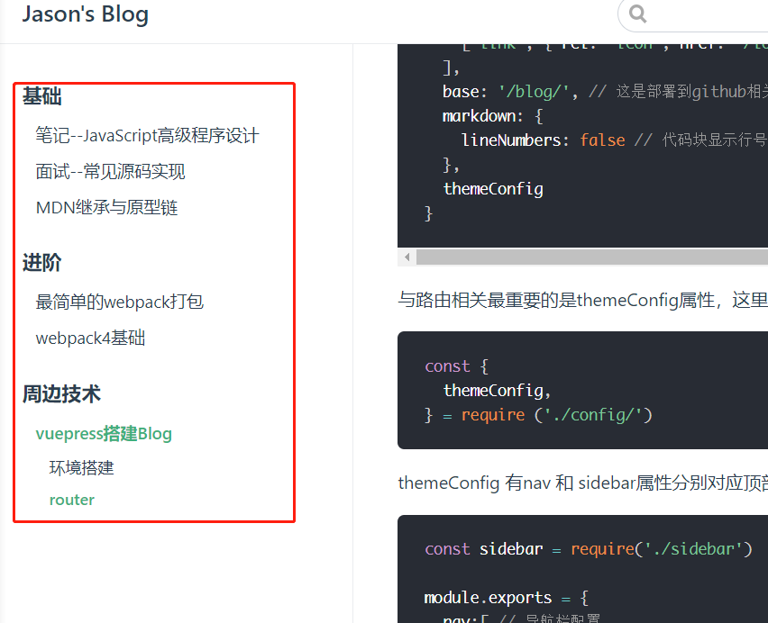
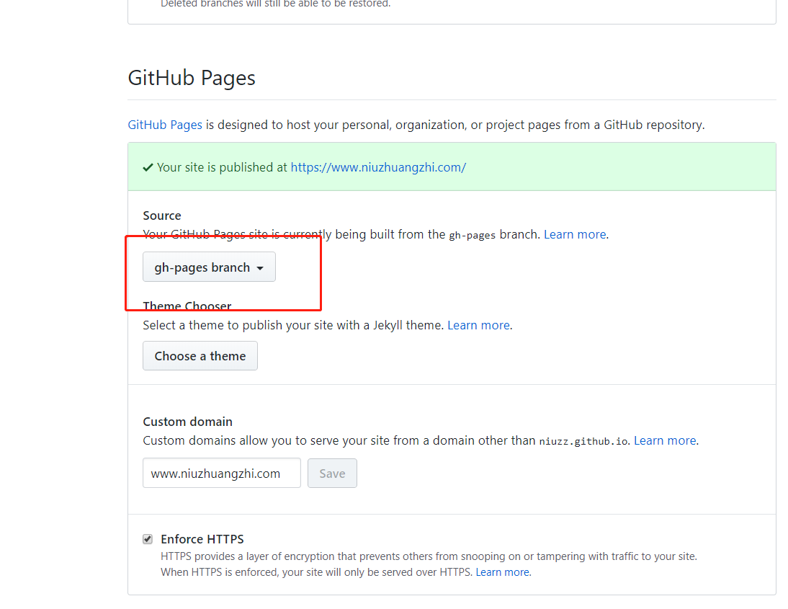

## 环境搭建

搭建目录
```bash
mkdir blog  #  项目目录
mkdir blog/docs
mkdir blog/docs/.vuepress  # vuepress配置和打包目录
cd blog
npm init -y  # 生成package.json
```

下载安装 vuepress

```bash
npm install vuepress -D
```

新建 markdown 文件

```bash
echo '# Hello VuePress!' > docs/README.md

npx vuepress dev docs  # 开始写作
```

## router
vuepress路由主要是在 .vuepress目录下的 config.js里进行配置

```js
module.exports = {
  title: 'Jason\'s Blog',
  description: 'Jason个人站，技术，营销和白日梦',
  head: [ // 注入到当前页面的 HTML <head> 中的标签
    ['link', { rel: 'icon', href: '/logo.jpg' }], // 增加一个自定义的 favicon(网页标签的图标)
  ],
  base: '/blog/', // 这是部署到github相关的配置
  markdown: {
    lineNumbers: false // 代码块显示行号
  },
  themeConfig
}
```
与路由相关最重要的是themeConfig属性，这里为了维护方便，分开写并引入了
```js
const {
  themeConfig,
} = require ('./config/')
```

themeConfig 有nav 和 sidebar属性分别对应顶部导航和侧边栏导航
```js
const sidebar = require('./sidebar')

module.exports = {
  nav:[ // 导航栏配置
    {text: '前端', link: '/前端开发/' },
    {text: '算法', link: '/算法/'},
    {text: '增长黑客', link: '/增长黑客/'},
    {text: '故事', link: '/故事/'}      
  ],
  sidebar,
  sidebarDepth: 3, // 侧边栏显示2级
}/*  */
```
侧边栏导航的生成


如图所示，侧边栏导航根据themeConfig.sidebar属性生成
```js
{
    title: "周边技术",
    collapsable: false,
    children: [
      "周边/vuepress搭建blog"
    ]
}
```
其中children中放的是markdown文件在项目里的路径

配置完这些，基本上的导航就有了。

## markdown编写
md文件的编写，就按照一般的md规范即可。以下几点稍作注意

每个md title字段将被用来显示导航的名称

比如现在这篇：
```markdown
---
title: "vuepress搭建Blog"
---
```

另外分段落编写，2号标题以下将在侧边栏导航自动显示，形成锚点.

比如现在的标题
```md
## markdown编写
```

## 发布部署
Blog写完之后，需要发布到服务器。

首选Github，提供的git pages。

这个本来是用于写一些项目的静态展示和介绍。利用他能方便，快速的搭建一个静态展示站点，当然也包括Blog.

1. 在github上创建blog仓库
2. 在 docs/.vuepress/config.js配置正确的base
```js
base: '/blog/', // 这是部署到github相关的配置
```
3. 在项目根目录创建deploy.sh脚本
```sh
#!/usr/bin/env sh

# 确保脚本抛出遇到的错误
set -e

# 生成静态文件
npm run build

# 进入生成的文件夹
cd docs/.vuepress/dist

# 如果是发布到自定义域名
# echo 'www.yourwebsite.com' > CNAME

git init
git add -A
git commit -m 'deploy'

# 如果你想要部署到 https://USERNAME.github.io
# git push -f git@github.com:niuzz/niuzz.github.io.git master

# 替换成自己的用户名和仓库名
git push -f git@github.com:<USERNAME>/<REPO>.git master:gh-pages

cd -
```
双击deploy.sh运行脚本，会在刚创建的blog仓库创建gh-pages分支

登入创建的github/blog仓库，修改仓库的发布源



即完成发布。

为了方便起见，将部署的命令写入package.json
```js
 "scripts": {
    "dev": "vuepress dev docs",
    "build": "vuepress build docs",
    "deploy": "bash deploy.sh"
  },
```
下次发布时，只需要执行

```bash
npm run deploy
```

-----
END