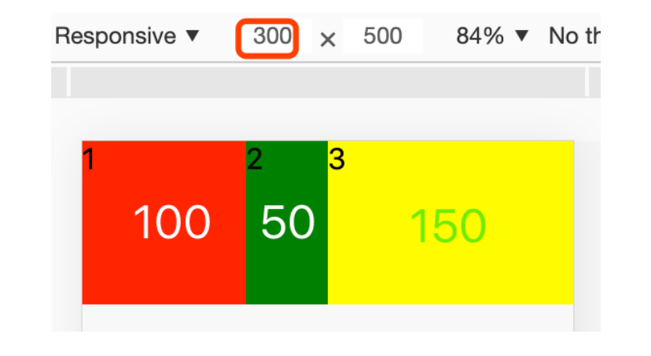
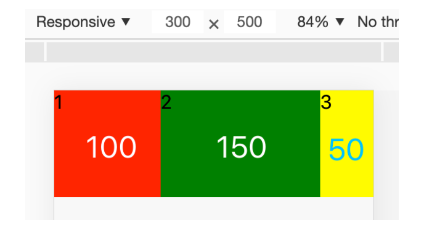
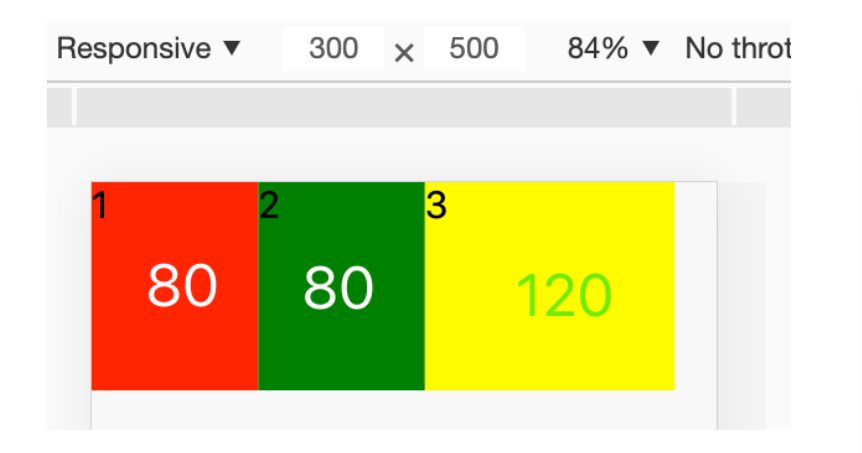

🎯--- 内容预览 ---🎯

- [基础](#基础)
- [css世界](#css世界) 
- css 揭秘 笔记

## 基础

### 选择器
```css
/*id*/
#content{
    color: #fff;
    background: #000;
}
/*类*/
.list-item{
    border-bottom: 1px solid #ccc;
}
/*通配符*/
*{
    margin: 0;
    padding: 0;
}
/*标签*/
h1{
    font-size: 20px;
}
/*属性*/
a[href]{
    color: red;
}
input[type=text]{
    color: red;
}
/*<input class="input text" type="text">*/
input[class=input]{ /* 选不中 */
    color: red;
}
input[class~=input]{/* 选中 */
    color: red;
}
/*
<!-- HTML： -->
<div class="article">我是article</div>
<div class="article-title">我是article-title</div>
<div class="article-content">我是article-content</div>
<div class="article_footer">我是article_footer，不是以artical-开头的</div>
选中 xxx 或者 xxx- 开头的
*/
div[class|=article]{/* 1.2.3选中 4选不中  */
    color: red;
}
div[class^=article]{ /* 以正则匹配，xxx开头即可 */
    color: red;
}
/*
<button class="btn btn-disabled">禁用的按钮</button>
<select class="select select-disabled city-select"></select>
<input class="input input-disabled" value="禁用的输入框"/>
*/
[class$=disabled]{ /* 结尾 */
    display: none;
}
[class*=disabled]{ /*包含即可 */
    display: none;
}
.page .article p{ /* 后代 */
    font-size: 18px;
}
.page > p{ /* 子元素 不会作用所有后代*/
    color: grey;
}
/*子元素和后代类似，子元素效率更高，更安全*/

/*
<div class="article">
    <p>黑化肥与灰化肥</p>
    <h1>我是标题部分</h1>
    <p>黑化肥发灰，灰化肥发黑</p>
    <p>黑化肥发灰会挥发；灰化肥挥发会发黑</p>
    <p>黑化肥挥发发灰会花飞；灰化肥挥发发黑会飞花</p>
</div>
*/
h1 + p{ /* 相邻兄弟， 这里是第二个P */
    margin-top: 10px;
    color: red;
} 
/*
相邻兄弟一般用来，自动调整占位，以及控制相同元素间隔
*/
h1 ~ p{ /* 通用兄弟 h1后面的所有p */
    color: red;
}
.menu-item{
    background: #ccc;
    color: #000;
}
.menu-item.active{ /*交集选择器*/
    background: #aaa;
    color: #fff;
}
h1, h2, h3{ /* 并集选择器 */
    margin: 0;
    padding: 0;
}
```
### 伪类 伪元素选择器
#### 伪类
> 1. 标记状态伪类  
> :link   
> :visited   
> :hover   
> :active
> 2. 筛选功能伪类
> :empty   
> :checked   
> :disbaled   
> :last-child   
> :nth-child(an+b)   // 2n+1 2的整数倍+1 即1、3、5、7、9
> :only-child
> :only-of-type

#### 伪元素
> ::first-line 元素第一行   
> ::first-letter 元素第一个字   
> ::before 元素前   
> ::after 元素后   
> ::selection 光标选中元素   
> <ol>
  > <li>伪元素选择器构造的元素是虚拟的，所以不能用 JS 去操作它。</li>
  > <li>如果同时使用了 before 和 first-letter 两个伪类，第一个字是要从 before 里的内容开始算起的，如果 before里面的内容是一个非文本元素，那 first-letter 也会作用在这个非文本元素上，但是不一定能生效。</li>
  > <li>first-line 和 first-letter 不适用于内联元素，在内联元素中这两个选择器都会失效。</li>
  > <li>在 CSS3 中，规定了伪类用一个冒号（:）表示，伪元素用两个冒号表示（::）。但除了 selection，其余四个伪元素选择器已经在 CSS2 中存在且和伪类用的是一样的单冒号表示的。为了向下兼容，现在的浏览器中伪元素选择器用单冒号和双冒号都可以。在没有兼容问题的情况下，还是建议大家按着新的 CSS3 标准来开发。</li>
> </ol>

**⭐页面加载顺序⭐**
<ol>
  <li><strong>HTML 的加载</strong><br>
  输入 URL 后，最先拿到的是 HTML 文件。HTML是一个网页的基础，所以要在最开始的时候下载它。HTML下载完成以后就会开始对它进行解析。</li>
  <li><strong>其他静态资源下载</strong><br>
  HTML 在解析的过程中，如果发现 HTML 文本里面夹杂的一些外部的资源链接，比如 CSS、JS 和图片等时，会立即启用别的线程下载这些静态资源。这里有个特殊的是 JS 文件，当遇到 JS 文件的时候，HTML 的解析会停下来，等 JS 文件下载结束并且执行完，HTML 的解析工作再接着来。这样做是因为 JS 里可能会出现修改已经完成的解析结果，有白白浪费资源的风险，所以 HTML 解析器干脆等 JS 折腾完了再干。</li>
  <li><strong>DOM 树构建</strong><br>
  在 HTML 解析的同时，解析器会把解析完的HTML转化成DOM 对象，再进一步构建 DOM 树。</li>
  <li><strong>CSSOM 树构建</strong><br>
  当 CSS 下载完，CSS 解析器就开始对 CSS 进行解析，把 CSS 解析成 CSS 对象，然后把这些 CSS 对象组装起来，构建出一棵 CSSOM 树。</li>
  <li><strong>渲染树构建</strong><br>
  DOM 树和 CSSOM 树都构建完成以后，浏览器会根据这两棵树构建出一棵渲染树。</li>
  <li><strong>布局计算</strong><br>
  渲染树构建完成以后，所有元素的位置关系和需要应用的样式就确定了。这时候浏览器会计算出所有元素的大小和绝对位置。</li>
  <li><strong>渲染</strong><br>
  布局计算完成以后，浏览器就可以在页面上渲染元素了。比如从 (x1, y1) 到（x2, y2）的正方形区域渲染成蓝色。经过渲染引擎的处理后，整个页面就显示在了屏幕上。
  </li>
</ol>

> dom树和cssom树合在一起成为渲染树    
> 样式的优先级     
> 内联样式 > ID选择器 > 类选择器 > 标签选择器 > 通用选择器 > 继承样式 > 浏览器默认样式

1、渲染树的构建过程中，会遍历 DOM 树中的可见节点，然后在 CSSOM 树中查找每个节点匹配的样式，最后通过组合这些可见节点以及和它们相匹配的样式就可以构建出一棵渲染树（带有“visibility: hidden;”属性的元素不可见，但会在页面中占位，所以会出现在渲染树中）。这里在查找的时候，出于效率的考虑，会从 CSSOM 树的叶子节点开始查找，对应在 CSS 选择器上也就是从选择器的最右侧向左查找。所以后代选择器“.page .article p”会有效率问题的原因这个选择器中会最先在 CSSOM 的所有叶子节点里查找 p 标签，这种标签类的选择器会很多且没有索引，会造成查找效率低下。不建议使用标签选择器和通配选择器的原因也是这个。

2、兄弟选择器为什么只能向后寻找兄弟元素。这是因为在生成渲染树的时候会遍历 DOM 节点来生成渲染树的节点，当遇到兄弟选择器的时候，它前面的兄弟元素在渲染树上的节点已经生成完毕，而它后面的兄弟节点还没有生成。这时候如果再回头去改前面兄弟节点的那就麻烦了，整个遍历的规则都要变化，而后面兄弟节点在生成的时候把兄弟选择器的影响加进去就可以。所以这就是为什么兄弟选择器只能向后寻找兄弟元素，而没提供向前寻找的方式。

**⭐页面层级⭐**
<ol>
  <li>HTML 在渲染的时候最先渲染的是标准文档流，所以标准文档流中的内容会被排在最下一层，标准文档流中如果还有层级，那就是后出现的会挡住先出现的。</li>
  <li>float 元素在标准文档流之后渲染，所以 float 会在标准文档流的上一层。</li>
  <li>绝对定位的元素最后渲染，所以默认情况下绝对定位元素会排在最上层。</li>
</ol>

**⭐重排，重绘⭐**
1. 重排 (回流)
当我们在 DOM 树中新增、删除了元素，或者是改变了某些元素的大小、位置、布局方式等，在这个时候渲染树里这个有改动的节点和它会影响的节点，都要重新计算。在改动发生时，要重新经历 DOM 的改动、 CSSOM 树的构建、渲染树的构建、布局和绘制整个流程，这个过程就叫做“重排”，也有的叫做“回流”。
比如：
.header display: none , 使用js 改为display：block
<ul>
  <li>DOM 树没有变化。</li>
  <li>CSSOM 树中这个样式节点里的 display 属性没有了。</li>
  <li>渲染树中的变化就比较大了，因为之前 “display:none;” 的元素没有出现在渲染树中，所以这个时候渲染树就要再重新结合 DOM 树和 CSSOM 树，把 .header 这个元素和它的子元素都加到渲染树中来。</li>
  <li>布局的过程也会有不小的花销，需要给新加进来的 .header 元素找到位置，然后再把后面影响到的所有元素的大小和位置都重新计算一遍。这样得到一个新的布局值。</li>
  <li>最后就是按着新的布局，把 .header 和受它影响的元素都重新绘制一遍，这个页面的改动就生效了。</li>
</ul>

2. 重绘
重绘是当我们改变元素的字体颜色、背景色等外观元素的时候，并不会改变它的大小和位置，也不会影响到其他元素的布局，这个时候就没有必要再重新构建渲染树了。浏览器会直接对元素的样式重新绘制，这个过程就叫做“重绘”。
比如：
我们给.content 添加 color: red
<ul>
  <li>DOM 树没有变化。</li>
  <li>CSSOM 树中 .content 对应的节点加入一条 “color: black;” 的样式。</li>
  <li>Color 属性的改变不会造成渲染树结构的变化，所以会在现有的渲染树中找出 .content 元素，给它加上 “color: black;” 的样式。</li>
  <li>因为存在样式继承机制，所以浏览器还会找到 .content 元素的子元素，如果有可以继承的节点，那么也要给这些节点加上 “color: black;” 的样式。</li>
  <li>不涉及位置变动，布局过程直接忽略。</li>
  <li>对 .content 元素及其子元素占用的块重新绘制。</li>
</ul>
<br/>**Tips:**<br/>
为了减少重排，可以通过几种方式优化：<br>
1、不要逐项的更改样式，可以把需要改动的样式收集到一块，用一次操作改变。<br>
2、可以使用 class 的变动代替样式的改变，也能达到第1条的效果。<br>
3、不要循环操作 DOM，循环的结果也要缓存起来，最后用一次操作来完成。<br>
4、需要频繁改动的元素（比如动画）尽量使用绝对定位，脱离文档流的元素会减少对后面元素的影响。<br>
5、在条件允许的情况下尽量使用 CSS3 动画，它可以调用 GPU 执行渲染。</p>

**⭐优化：⭐**
- 属性顺序
1. 位置属性 (position, top, right, z-index, display, float等)　　
2. 大小 (width, height, padding, margin)　　
3. 文字系列 (font, line-height, letter-spacing, color- text-align等)　　
4. 背景 (background, border等)
5. 其他 (animation, transition等)
- 属性使用规范
<ol>
  <li>不大面积的使用 gif 图片。显示 gif 图片的消耗比较大，所以一个页面里不要大面积使用 gif 图片。</li>
  <li>尽量不要对图片进行缩放，这也是一个高消耗的操作。</li>
  <li>减少高消耗属性的使用 box-shadow/border-radius/filter/ 透明度 /:nth-child 等</li>
  <li>动画里使用 3D 属性代替一般属性，如使用 transform、scale 等代替原始的 width、height、margin 等，因为这些 CSS3 的属性可以调用 GPU 进行渲染，会减少资源的消耗并提高动画的流畅度。</li>
</ol>

### 开发相关

- rest
```css
/* 去掉所有元素的内外边距 */
html, body, div, span,
h1, h2, h3, h4, h5, h6, p, pre,
a, img,  ul, li, form, label, input,
table, tbody, tfoot, thead, tr, th, td,
audio, video {
	margin: 0;
	padding: 0;
}
/* 统一全局字体 */
body {
	font-family: -apple-system-font,BlinkMacSystemFont,"Helvetica Neue","PingFang SC","Hiragino Sans GB","Microsoft YaHei UI","Microsoft YaHei",Arial,sans-serif
}
/* 列表元素去掉默认的列表样式 */
ol, ul {
	list-style: none;
}
/* Table元素的边框折叠 */
table {
	border-collapse: collapse;
	border-spacing: 0;
}
/* 去掉默认的下划线 */
a{
	text-decoration: none;
}
/* 去掉input自带的边缘效果和背景颜色 */
input{
	outline: none;
	background: none;
}
```

- 移动端断点

把宽度分成三个区间，340px到410px的宽度内的屏幕定为基准区间（以iPhone6/7/8屏幕的375px作为基准，向两边浮动35px就是这个基准区间），
而另外两个区间就是小于340px的部分和大于410px的部分，用代码表示出来就是：
```css
/* 屏幕宽度小于340px时的样式 */
@media (max-width: 340px){ /* 样式1 */ }

/* 屏幕宽度在340px至410px时的样式 */
@media (min-width: 340px) and (max-width: 410px){ /* 样式2 */ }

/* 屏幕宽度大于410px时的样式 */
@media (min-width: 410px){ /* 样式3 */ }
```
简化
```css
/* 屏幕宽度在340px至410px时，基准尺寸使用20px */
html{
    font-size: 20px;
}
/* 屏幕宽度小于340px时，基准尺寸使用18px */
@media (max-width: 340px){ 
    html{
        font-size: 18px;
    }
}
/* 屏幕宽度大于410px时，基准尺寸使用22px */
@media (min-width: 410px){ 
    html{
        font-size: 22px;
    }
}
```
login 水平垂直居中
```css
.login {
      position: fixed;
      width: 300px;
      height: 400px;
      background: #ddd;
      top: -10%;
      left: 0;
      bottom: 0;
      right: 0;
      margin: auto;
    }
```
移动端body样式
```css
body{
    max-width: 640px;
    margin: 0 auto;
    background: #f8f8f8;
    overflow-x: hidden;
    -webkit-overflow-scrolling: touch;
}
```
长文本截断
```css
.text {
  overflow: hidden; 
  white-space: nowrap; 
  text-overflow: ellipsis;
}
```

### flex
1. flex-grow
<blockquote>
flex-grow 属性用来指定弹性盒子的拉伸方式。当一行内的弹性盒子不能充满整行时，就用这个属性来指定怎么去分配空闲的空间。flex-grow 的默认取值是 0，就是不去占用空闲区域。当 flex-grow 为非 0 数字的时候，这个弹性盒子就要进行拉伸了。具体拉伸多少，要看这一行里面有多少个需要拉伸的对象，这些需要拉伸的盒子按着 flex-grow 值的比例分配空闲区域的空间。以下面为例：
</blockquote>
```css
/* CSS */
.flex-box{
    display: flex;
}
.flex-box > .box{
    width: 50px;
    height: 100px;
}
.flex-box > .box1{
    flex-grow: 1;
    background: red;
}
.flex-box > .box2{
    background: green;
}
.flex-box > .box3{
    flex-grow: 2;
    background: yellow;
}
```
<blockquote>
上面三个弹性盒子原始宽度都是 50px，整个屏幕是 300px宽，所以会有 150px 的空白区域。当我们给 box1 的“flex-grow”设为1；box2 没有“flex-grow”属性，默认为 0；box3的“flex-grow”设为 2。这样在分配空间的时候，box1 的“flex-grow”是 1，分得 1/3 的空白区域，也就是 50px；box2 不分配空闲空间；box3 的“flex-grow”是 2，分得 2/3 空白区域，也就是 100px。这样 box1 和 box3 就会拉伸，新的宽度是原宽度加上占用空白区域的宽度之和。box1 的宽度会变成 100px，box3 的宽度会变成 150px，结果如下：
</blockquote>



2. flex-shrink
<blockquote>
我们在使用弹性布局的时候，通常是使用它可以拉伸的特性，但是弹性盒子也可以是收缩的。flex-shrink 属性就是用来指定弹性盒子的收缩方式的，当所有盒子的宽度加起来超过了容器的总宽度，每个盒子就要缩减一定的尺寸来保证所有盒子都能在容器中。flex-shrink 的默认值是 1，也就是默认情况下所有盒子平分超出部分的尺寸。
</blockquote>
```css
/* CSS */
.flex-box{
    display: flex;
}
.flex-box > .box{
    width: 150px;
    height: 100px;
}
.flex-box > .box1{
    flex-shrink: 1;
    background: red;
}
.flex-box > .box2{
    flex-shrink: 0;
    background: green;
}
.flex-box > .box3{
    flex-shrink: 2;
    background: yellow;
}
```
<blockquote>
我们把刚才的例子稍微修改一下，每个盒子设置为 150px宽，容器还是 300px，这样三个盒子宽度加起来会多出150px。这时候如果不给三个盒子指定收缩方式，那么多出来的 150px 就会由三个盒子平分，每个盒子收缩 50px，最终就是每个盒子都是 100px 宽。但如果我们给 box1 加上“flex-shrink: 1;”，给box2加上“flex-shrink: 0;”，给 box3 加上“flex-shrink: 2;”，这样压缩的情况就会不一样了。这时候“flex-shrink”不为0的元素就要通过收缩来消化掉多余的宽度，收缩的多少也是由“flex-shrink”值所占的比例来决定。
<ul>
  <li>box1 会消化超出部分的 1/3，也就是收缩 50px，宽度变为100px。</li>
  <li>box2 的“flex-shrink”值设置为 0，不参与压缩。</li>
  <li>box3 会消化超出部分的 2/3，也就是收缩 100px，宽度变为 50px。</li>
</ul>
</blockquote>



3. flex-basis
<blockquote>
flex-basis 属性是用来指定弹性盒子基准宽度的。在弹性布局里，弹性盒子最终的宽度通常不是 width 属性指定的值，所以这里用 width 就显得不太准确。作为替代，弹性布局里给出了 flex-basis，它的作用和 width 属性很类似，但是把这个宽度叫做基准值，就显得严谨的多了。flex-basis 属性的优先级要高于 width，无论使用什么样的选择器，当两个属性同时作用在同一个弹性盒子上的时候，都是以 flex-basis 为准。
</blockquote>
```css
.flex-box{
    display: flex;
}
.flex-box > .box1{
    flex-basis: 80px;
    background: red;
}
.flex-box > .box2{
    flex-basis: 80px;
    background: green;
}
.flex-box > .box3{
    flex-basis: 120px;
    background: yellow;
}
.flex-box > .box{
    width: 50px;
    height: 100px;
}
```


width没有生效

4. flex属性
```css
flex: <flex-grow> <flex-shrink> <flex-basis>
```
<blockquote>
<ul>
  <li><strong>默认情况</strong>，当不指定flex值时，默认的就是“flex: 0 1 auto;”，和分开写的三个属性默认情况一样。</li>
  <li><strong>“flex: none;”</strong>，flex的值为none时，表示的意思是“flex: 0 0 auto;”，就是这个盒子既不伸展也不收缩。</li>
  <li><strong>“flex: auto;”</strong>，flex值为auto时，表示的意思是“flex: 1 1 auto;”，就是这个盒子是既能伸展也能收缩。</li>
  <li><strong>“flex: 1;”</strong>，flex值为1（也可以是其他非0数值）时，表示的意思是“flex: 1 1 0;”，这表示容器内的盒子会平分空间。</li>
</ul>
</blockquote>
5. flex-direction
```css
.flex-box{
    display: flex;
    flex-direction: row-reverse; /* row row-reverse column column-reverse */
}
```
6. align-items
<blockquote>
align-items 属性就是用来标记弹性布局里的元素在侧轴（也就是和 flex-direction 方向相垂直的轴）上的对齐方式，form 里所有元素都是水平排列的，所以想竖直居中，就可以直接使用“align-items:center;”来实现。align-items 有以下可取的值：
<ol>
  <li><strong>stretch</strong>（默认），元素进行抻拉来填满，如果盒子有指定大小，那么以指定的大小为准。</li>
  <li><strong>center</strong>，元素会布局在容器侧轴的中间位置。</li>
  <li><strong>flex-start</strong>，元素位于容器的开头。</li>
  <li><strong>flex-end</strong>，元素位于容器的结尾。</li>
  <li><strong>baseline</strong>，元素位于第一行文本的基准线位置，这里要注意是第一行的文本，而不是第一个元素。</li>
</ol>
</blockquote>

7. justify-content
<div class="cl-preview-section"><blockquote>
<p><strong>@ Tips:</strong><br>
justify-content 属性是在弹性布局中，用来定义主轴上元素的排列方式的，这个属性要作用于弹性布局中的容器上。这个属性有以下可取的值：<br>
<strong>flex-start</strong>：弹性盒子里的所有元素从容器起始位置开始依次排列。这个起始位置并不是固定的，它会受到“flex-direction”的影响。比如“flex-direction”的值如果是“column-reverse”，那起始位置就在容器的最下面；如果“flex-direction”的值是默认的“row”，那么起始位置就是容器的最左边。效果如下：<br>
<br>
<strong>flex-end</strong>：和上面的 flex-start 相反，使用这个属性时，所有元素会和弹性盒子的末尾对齐。但要注意，使用这个属性值并不会改变元素的排布顺序。使用 flex-end 的效果如下：<br>
<br>
<strong>center</strong>：这个属性会让弹性盒子里的所有元素排布在页面的中间，把所有空白区域平均分配在容器的两边。使用center时的效果如下：<br>
<br>
<strong>space-between</strong>：这个属性是让容器里的空白空间平均分配在每两个元素中间，也就是第一个元素和容器起始位置对齐，最后一个元素和容器结束位置对齐，而每两个元素中间都留下等距的空间。这个属性就和上面列表项里文本区域排布的需求比较吻合，只是在竖直方向上应用就可以了。下面是使用 space-between 时的效果：<br>
<br>
<strong>space-around</strong>：这个属性也是会把空白空间进行切割分配，和space-between不同的是这种分隔方式会给每个元素两侧都分配等距的空间。这样在容器的两边会留出一份的空间，而每两个元素中间会有两份空间的间隔。使用space-around时的效果如下：<br>
<br>
在使用justify-content属性的时候有两点要注意：</p>
<ol>
<li>justify-content是弹性布局中特有的属性，所以要和“display: flex;”配合使用。</li>
<li>如果弹性盒子里的元素有使用“flex-grow:1;”这类属性或者其他方式导致弹性容器已经被撑满，那么这时候justify-content就没什么意义了。</li>
</ol>
</blockquote>
</div>


## css世界
张鑫旭大神出的书。

我们在编写页面的时候，无论是布局，浮动，定位，盒模型应用，等等。虽然有各种各样或正常，或hacker的写法，我们用的多了也能了然于心，但是css背后真正的原理，我们很少去关心，这本书就是讲清背后原理的书。

css在前端工作中，始终得不到太多的重视，但是我们想想，css难道不重要么。我觉得每一个前端都应该好好看看。


