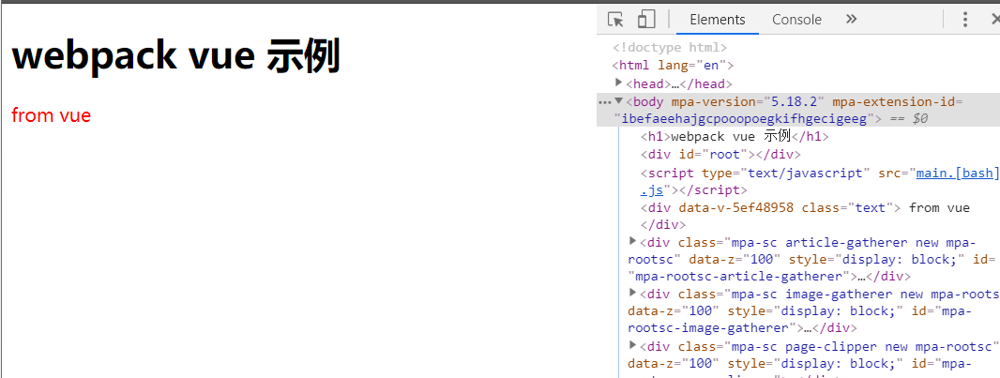

🎯---目标---🎯
- 搭建基本环境
- 支持vue
----

我们大部分创建vue项目都是通过官方脚手架vue-cli创建，vue-cli十分完备，并且交互友好，推荐大家使用。

这里使用webpack4搭建vue项目，只是为了更熟悉webpack一般的配置使用。

## 基本环境搭建

1. 建立项目文件
```bash
mkdir webpack-vue
cd webpack-vue
yarn init -y #生成了项目 package.json
mkdir build 
touch build/webpack.base.conf.js # 基础配置
touch build/webpack.prod.conf.js # 生产
touch build/webpack.dev.conf.js # 开发
mkdir src 
touch src/main.js # 入口
```
下面在项目根目录下建 index.html

```html
<!DOCTYPE html>
<html lang="en">
<head>
  <meta charset="UTF-8">
  <meta name="viewport" content="width=device-width, initial-scale=1.0">
  <meta http-equiv="X-UA-Compatible" content="ie=edge">
  <title>webpack-vue 示例</title>
</head>
<body>
  
</body>
</html>
```
2. 安装webpack
```bash
yarn add webpack webpack-dev-server webpack-cli -D
```
3. 配置webpack, 先打开webpack.base.conf.js

```js
var path = require('path');
var webpack = require('webpack');
module.exports = {
    entry: {
        main: path.resolve(__dirname, '../src/main.js')
    },
    output: {
        publicPath: __dirname + "/dist/",
        path: path.resolve(__dirname, '../dist'),
        filename: '[name].[bash].js',
    },
    module: {
        rules: []
    },
    resolve: {

    }
}
```
4. 配置babel
babel-core 7.x babel-loader 8.x
```bash
yarn add babel-loader @babel/core babel-preset-env -D
```
webpack.base.conf.js
```js
module: {
        rules: [
          {
            test: /\.js$/,
            use: ['babel-loader'],
            exclude: /node_modules/
          }
        ]
    },
```
5. 处理图片
安装 file-loader url-loader
```bash
yarn add file-loader url-loader -D
```
url-loader会将20k以下图片进行base64编码
webpack.base.conf.js rules属性增加以下

```js
{
      test: /\.(png|jpg|jpeg|gif)$/,
      use: [
        {
          loader: "url-loader",
          options: {
            name: "[name]-[hash:5].min.[ext]",
            limit: 20000, // size <= 20KB
            publicPath: "static/",
            outputPath: "static/"
          }
        }
      ]
}
```
6. 处理 sass
```js
{
    test: /\.(sa|sc|c)ss$/,
    use: [
            {loader: 'vue-style-loader'},
            'css-loader',
            'sass-loader'
          ]
},
```
7. 生成打包html
```bash
yarn add html-webpack-plugin -D
```
webpack.base.conf.js
```js
var HtmlWebpackPlugin = require('html-webpack-plugin');
plugins: [
    new HtmlWebpackPlugin({
        template: path.resolve(__diename, '../index.html')
    }),
]
```

8. 配置开发和生产环境
```bash
yarn add webpack-merge -D
```
开发 webpack.dev.js
```js
const merge = require('webpack-merge');
const baseConfig = require('./webpack.base.conf');
const path = require('path');
const webpack = require('webpack');
module.exports = merge(baseConfig, {
    devtool: 'inline-source-map', // 压缩方式
    mode: 'development'
    devServer: {
     hot: true, // 热更新
     open: true, // 自动打开页面
     contentBase: path.resolve(__dirname, '../dist'), // 告诉服务从哪提供内容
    },
    plugins: [
        new webpack.HotModuleReplacementPlugin(), //开启热更新
    ]
})
```
生产 webpack.prod.conf.js

```js
const merge = require('webpack-merge');
const baseConfig = require('./webpack.base.conf');
const path = require('path');
const webpack = require('webpack');
module.exports = merge(baseConfig, {
    devtool: 'source-map', // 压缩方式
    mode: 'production'
    plugins: [
    ]
})
```
这时候 npm run dev 项目应该能正常启动了

## 支持vue

vue 需要安装 vue vue-loader vue-template-compiler vue-style-loader

其中vue-loader需要安装css-loader ,vue-style-loader前面已经装过
```bash
yarn add vue vue-loader vue-template-compiler
```
webpack-base.conf.js
```js
moduleL {
  rules: [
    {
      test: /\.vue$/,
      loader: 'vue-loader'
    },
    {
      test:/\.scss$/,
      use: [
        'vue-style-loader',
        'css-loader',
        'sass-loader'
      ]
    },
  ]
}
 plugins: [
      new VueLoaderPlugin()
  ]
```
根目录下写个app.vue
```html
<template>
  <div class="text"> from vue</div>
</template>

<script>
export default {}
</script>

<style lang="scss" scoped>
.text {
  color: #f00;
}
</style>

```
运行 yarn dev



vue 文件已经可以正确解析，页面内的sass代码也能正确渲染。

我们已经完成了，解析vue基本的webpack搭建。

后面我们再继续深入。

---
End


