🎯---目标---🎯
- [webpack 核心](#核心)
- [基础用法](#基础用法)
- [进阶用法](#进阶用法)
- [编写可维护构建配置](#编写可维护的webpack构建配置)
- [优化](#优化)
- [源码](#源码)

---

## 核心

### entry
依赖图的入口是entry

对于非代码比如图片、字体依赖会不断加入到依赖图中
```js
// 单入口
module.exports = {
  entry: './path/to/entry.js'
}
// 多入口
module.exports = {
  entry: {
    app: './src/app.js',
    adminApp: './src/adminApp.js'
  }
}
```

### output
output 用来告诉webpack如何将编译后的文件输出到磁盘
```js
// 单入口
module.exports = {
  entry: './src/app.js',
  output: {
    filename: 'bundle.js',
    path: __dirname + '/dist'
  }
}
// 多入口
module.exports = {
  entry: {
    app: './src/app.js',
    adminApp: './src/adminApp.js'
  },
  output: {
    filename: '[name].js', // 占位符
    path: __dirname + '/dist'
  }
}
```

### loaders
webpack 开箱只支持js 和 json ，通过loaders去支持其他文件类型，并且把他们转化成有效的模块。并且可以添加到依赖图中。

loader本身是一个函数，接受源文件作为参数，返回转换的结果

常用 loaders
- babel-loader
- css-loader
- sass-loader
- ts-loader
- file-loader
- raw-loader # 将文件以字符串形式导入
- thread-loader # 多进程打包js和css
```js
module.exports = {
  module: {
    rules: [
      {
        test: /\.txt$/, // 指定匹配规则
        use: 'raw-loader' // 指定loader
      }
    ]
  }
}
```

### plugins
插件用于bundle文件的优化， 资源管理和环境变量注入，作用于整个构建过程

extract-text-webpackplugin 已经替换成mini-css-extract-plugin，commonsChunkPlugin 替换成了 splitchunksplugin。

常用plugins
- CommonsChunkPlugin #将chunks相同的模块代码提取成公用js, 已淘汰  splitchunksplugin
- CleanWepackPlugin #清理构造目录
- ExtractTextWebpackPlugin #将css文件中的css提取出来成为单独css 已淘汰 miniCssExtractPlugin
- CopyWebpackPlugin #copy
- HtmlWebpackPlugin #创建html承载输出的bundle
- UglifyjsWebpackPlugin #压缩js
- zipWebpackPlugin #将打包资源生成zip
```js
module.exports = {
  plugins = [
    new HtmlWebpackPlugin({
      template: './src/index.html'
    })
  ]
}
```

### mode
mode指定当前构建环境: production、 development、none
设置mode可以用webpack内置函数，默认是None
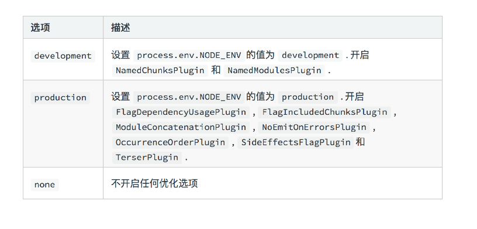


## 基础用法
### js react解析
```js
module.exports = {
  module: {
    rules: [
      {
        test: /\.js$/
        use: 'babel-loader'
      }
    ]
  }
}
```
.babelrc
```bash
yarn add @babel-core @babel/preset-env babel-loader
```

```js
{
  'presets': [
    '@babel/preset-env',  // 解析ES6 plugin的集合
    '@babel/preset-react' // react
  ],
  'plugins': [
    '@babel/proposal-class-properties' // 一个plugin对应功能
  ]
}
```

### css

css-loader 加载css文件，转换成commonjs对象
style-loader 将样式通过 style 标签插入 head中

自右向左顺序加载
```js
module.exports = {
  rules: [
    {
      test: /\.css$/
      use:[
        'style-loader', // 和提取miniCssExtractPlugin互斥， 可以换为miniCssExtractPlugin.loader
        'css-loader',
        'sass-loader'
      ]
    }
  ]
}
```

### 图片，字体
```js
module.exports = {
  module: {
    rules: [
      {
        test: /\.(png | svg | jpg | gif)$/,
        use: [
          // 'file-loader'
          {
            loader: 'url-loader',
            options: {
              limit: 10240 // 字节
            }
          }
        ]
      },
      {
        test: /\.(woff|woff2|eot|ttf|otf)$/,
        use: 'file-loader'
      }      
    ]
  }
}
```

### 文件监听
开启监听
- 启动webpack --watch
- webpack.config.js 设置 watch: true
原理
> 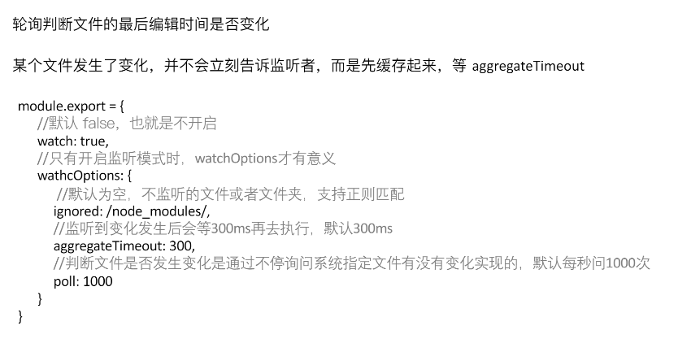

### 热更新
1. 使用hotModuleReplacementPlugin插件
package.json
```js
scripts: {
  'dev': 'webpack-dev-server'
}
```
webpack.config.js
```js
import webpack from 'webpack'

plugins: [
  new webpack.HotModuleReplacementPlugin()
],
devServer: {
  contentBase: './dist', // 必须设
  hot: true // 如果配置hot则会自动引入 hotModuleReplacementPlugin
}
```
2. 使用webpack-dev-middleware
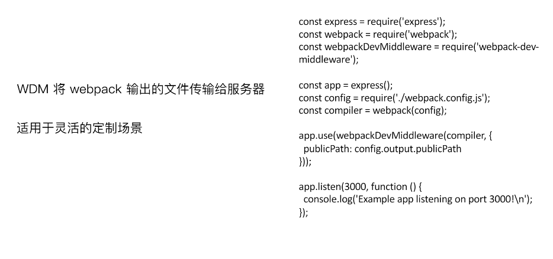

3. 热更新原理
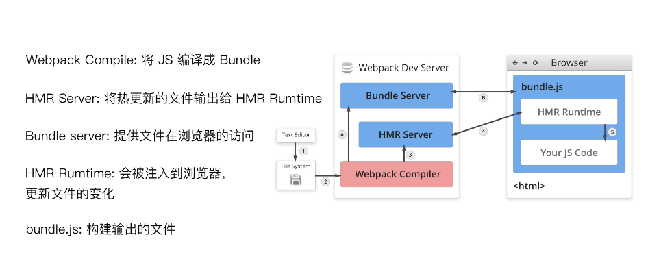

### 文件指纹
版本管理
生成文件指纹只要有三种
- Hash
- Chunkhash
- ContentHash

js 文件指纹

```js
output: {
  filename: '[name][chunkhash:8].js',
  path: __dirname + '/dist'
}
```

css 文件指纹

webpack.config.js
```js
plugins: [
  new MiniCssExtractPlugin({
    filename: '[name][contenthash:8].css'
  })
]
```

图片、字体文件指纹
```js
module.exports = {
  module: {
    rules: [
      {
        test: /\.(png | svg | jpg | gif)$/,
        use: [
          // 'file-loader'
          {
            loader: 'url-loader',
            options: {
              limit: 10240 // 字节,
              name: 'img/[name][hash:8].[ext]' // 文件内容的hash默认md5生成
            }
          }
        ]
      }     
    ]
  }
}
```

### 代码压缩
1. js压缩

内置了uglifyjs-webpack-Plugin

2. css
```js
plugins: [
  new OptimizeCSSAssetsPlugin({
    assetNameRegExp: /\.css$/g,
    cssProcessor: require('cssnano')
  })
]
```

3. html
```js
plugins: [
  new HtmlWebpackPlugin({
    template: 'src/search.html',
    filename: 'search.html',
    ...
    chunks: ['search'],
    inject: true,
    minify: {
      html5: true,
      collapseWhitespace: true,
      preserveLineBreaks: false,
      minifyCSS: true,
      minifyJS: true,
      removeComments: false
    }
  }),
  new HtmlWebpackPlugin({
    template: 'src/search.html',
    filename: 'search.html',
    ...
    chunks: ['index'],
    inject: true,
    minify: {
      html5: true,
      collapseWhitespace: true,
      preserveLineBreaks: false,
      minifyCSS: true,
      minifyJS: true,
      removeComments: false
    }
  })
]
```


## 进阶用法

### 清除构建目录
```js
const { CleanWebpackPlugin } = require('clean-webpack-plugin');
plugins: [
  new CleanWebpackPlugin()
]
```

### PostCSS rem转换

iOS分辨率
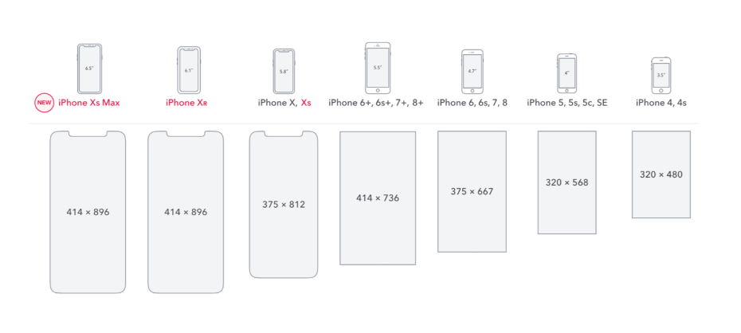

```js
module.exports = {
  {
      test: /.less$/,
      use: [
          MiniCssExtractPlugin.loader,
          'css-loader',
     
          {
              loader: 'postcss-loader',
              options: {
                  plugins: () => [
                      require('autoprefixer')({
                          browsers: ['last 2 version', '>1%', 'ios 7'] //新版本推荐写在package.json
                      })
                  ]
              }
          },
          'less-loader',
          {
              loader: 'px2rem-loader', // font-size:12px /*no*/  这样写不会转换
              options: {
                  remUnit: 75,
                  remPrecision: 8 // 小数点后位数
              }
          }
      ]
  },
}
```

### 静态资源内联
- 初始化脚本
- 上报打点
- css内联避免页面闪动
- 减少http请求

<strong style="color: #f00;">0.5.1才行，新版本导出模块export default这个在html下不行</strong>

raw-loader 内联 html
```js
<script>${require('raw-loader!babel-loader!./meta.html')}</script>
```
raw-loader 内联js
```js
<script>${require('raw-loader!babel-loader!../node_modules/lib-flexible')}</script>
```
css内联

1. style-loader
2. html-inline-css-webpack-plugin

### 多页面打包
glob.sync批量获取入口

```js
const glob = require('glob');
// 动态返回 entry和htmlWebpackPlugin
const setMPA = () => {
    const entry = {};
    const htmlWebpackPlugins = [];
    const entryFiles = glob.sync(path.join(__dirname, './src/*/index.js'));

    Object.keys(entryFiles)
        .map((index) => {
            const entryFile = entryFiles[index];
            // '/Users/cpselvis/my-project/src/index/index.js'

            const match = entryFile.match(/src\/(.*)\/index\.js/);
            const pageName = match && match[1];

            entry[pageName] = entryFile;
            htmlWebpackPlugins.push(
                new HtmlWebpackPlugin({
                    inlineSource: '.css$',
                    template: path.join(__dirname, `src/${pageName}/index.html`),
                    filename: `${pageName}.html`,
                    chunks: ['vendors', pageName],
                    inject: true,
                    minify: {
                        html5: true,
                        collapseWhitespace: true,
                        preserveLineBreaks: false,
                        minifyCSS: true,
                        minifyJS: true,
                        removeComments: false
                    }
                })
            );
        });

    return {
        entry,
        htmlWebpackPlugins
    }
}

const { entry, htmlWebpackPlugins } = setMPA();

module.exports = {
    entry: entry,
    output: {
        path: path.join(__dirname, 'dist'),
        filename: '[name]_[chunkhash:8].js'
    },
    plugins: [
        ...  
      ].concat(htmlWebpackPlugins),
```

### source map
- source map定义到源代码
- 开发环境开启 线上关闭
  线上问题可以把source map上报到监控系统里，排查问题

source map 关键字
- eval: 用eval包裹模块代码
- source map: 产生.map文件
- cheap: 不包括列信息
- inline: 将.map作为DataUrl嵌入，不生成.map文件
- module: 包含loader的source map

source map 类型
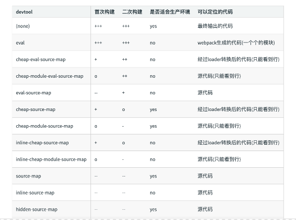

开启
webpack.config.js
```js
module.exports = {
  devtool: 'source-map'
}
```

### 提取页面公共资源
1. 将react react-dom通过cdn引入，不打入bundle
2. 方法一 通过html-webpack-exernals-plugin
3. 方法二 splitChunksPlugin 内置 代码分割(CommonsChunkPlugin废除)

    - 3.1 chunks参数
      - async 异步引入的库进行分离 (默认)
      - initial 同步引入的库进行分离
      - all 所有引入的库进行分离 (推荐)

    - 3.2 test匹配出要分离的包

#### html-webpack-exernals-plugin
```js
plugins = [
  new HtmlWebpackExternalsPlugin({
            externals: [
              {
                module: 'react',
                entry: 'https://11.url.cn/now/lib/16.2.0/react.min.js',
                global: 'React',
              },
              {
                module: 'react-dom',
                entry: 'https://11.url.cn/now/lib/16.2.0/react-dom.min.js',
                global: 'ReactDOM',
              },
            ]
    }),
]
```
同时 index.html
```html
<script src="https://11.url.cn/now/lib/16.2.0/react-dom.min.js"></script> ...
```

#### splitChunksPlugin
- 公共脚本分离, 减少node_module引用
```js
module.exports = {
  optimization: {
    splitChuns: {
      chunks: 'async',
      minSize: 30000, // 30K,
      maxSize: 0,
      minChunks: 1,
      maxAsyncRequests: 5,
      maxInitialRequests: 3,
      automaticNameDelimiter: '~',
      name: true,
      cacheGroups: {
        vendors: {
          test: /[\\/]node_modules[\\/]/,
          pripority: -10
        }
      }
    }
  }
}
```
- 分离基础包
```js
module.exports = {
  optimization: {
    splitChuns: {
      cacheGroups: {
        commons: {
          test: /(react | react-dom)/,
          name: 'vendors',
          chunks: 'all'
        }
      }
    }
  }
}
```
- 分离公共文件
```js
module.exports = {
  optimization: {
    splitChuns: {
      minSize: 0, // 分离包体积大小
      cacheGroups: {
        commons: {
          name: 'commons',
          chunks: 'all',
          minChunks: 2 // 最小引用次数
        }
      }
    }
  }
}
```
<strong style="color: #f00;">以上new HtmlWebpackPlugin的时候 chunks:['vendors', 'commons', pageName]</strong>

### tree shaking
- 概念： 1个模块可能有多个方法，只要其中某个方法整个文件都会被打包，tree shaking只把用到的方法打包，没用到的uglify阶段擦除掉

- 使用： webpack默认支持，.babelrc里设置modules： false即可
production mode下默认开启

- 要求：必须是ES6语法，CJS方式不支持

- 原理：DCE
  - 代码不会被执行，不可到达
  - 代码执行结果不会被用到
  - 代码只会去影响死变量(只写不读)
  > 利用ES6模块的特点
  > - 只能作为模块顶层的语句出现
  > - import的模块名只能是字符串常量
  > - import binding是immutablede  // 不可修改

### scope hoisting
现象： 构建后的代码存在大量闭包
1. webpack模块转换
  - 模块会被带上一层包裹
  - import会被转化成__webpack_require
2. scope hoisting原理
  - 将所有模块代码，按照引用顺序放在一个函数作用域，然后适当的重命名一些变量，防止变量冲突
3. 使用
  - 4 webpack mode为production默认开启
  - 3 plugins里 new webpack.optimize.ModuleConcatenationPlugin()
  - 必须是es6语法，CJS不支持 因为不能动态分析依赖

### 代码分割
将你的代码库分割成chunks(语块), 当代码运行需要他们的时候再加载

使用场景：
  - 抽离相同代码到共享块
  - 脚本懒加载，初始下载更小
    > 懒加载方式
    >
    > cjs: require.ensure
    >
    > es6: 动态import 目前原生没支持，需要babel转换

动态import
```js
npm i @babel/plugin-syntax-dynamic-import  -D
// .babelrc
plugins: [@babel/plugin-syntax-dynamic] 
```

### ESLint
1. 制定团队ESLint规范
> - 不重复造轮子，基于recommend配置改进 
> - 能够帮助发现代码错误的规则全部开启
> - 帮助团队代码风格统一，而不是限制开发体验
2. 落地
- 和CI/CD系统集成
- 和webpack继承 使用eslint-loader
```js
module: {
  rules: [
    {
      test: /\.js$/,
      use: [
        'babel-loader',
        'eslint-loader'
      ]
    }
  ]
}
```
.eslintrc.js
```js
module.exports = {
  'parser': 'babel-eslint',
  'extends': 'airbnb',
  'env': {
    'browser': true,
    'node': true
  },
  'rules': {
    'semi': 'error'
  }
}
```

### 打包库和组件
webpack除了可以用来打包应用，也可以用来打包js库
入口
```js
if (process.env.NODE_ENV = 'production') {
  module.exports = require('./dist/large-number.min.js')
}else {
  module.exports = require('./dist/large-number.js')
}
```
package.json
```json
{
  "name": "large-number",
  "version": "1.0.1",
  "description": "big number add",
  "main": "index.js", // 库打包必须有main
  "scripts": {
    "test": "echo \"Error: no test specified\" && exit 1",
    "build": "webpack",
    "prepublish": "webpack"
  },
  "keywords": [],
  "author": "",
  "license": "ISC",
  "devDependencies": {
    "terser-webpack-plugin": "^1.3.0",
    "webpack": "^4.34.0",
    "webpack-cli": "^3.3.4"
  }
}
```
webpack.config.js

```js
const TerserPlugin = require('terser-webpack-plugin'); 

module.exports = {
  entry: {
      'large-number': './src/index.js',
      'large-number.min': './src/index.js'
  },
  output: {
      filename: '[name].js',
      library: 'largeNumber',
      libraryTarget: 'umd',
      libraryExport: 'default'
  },
  mode: 'none', // 不压缩
  optimization: { // 只压缩 min
      minimize: true,
      minimizer: [
          new TerserPlugin({
              include: /\.min\.js$/,
          })
      ]
  }
}
```
打包完成可以发布npm 

### SSR

- 什么是渲染：

html + css + js + data ===> 渲染后的html

- 服务端渲染：

所有模板等资源存储在服务端 <br>
内网机器拉取数据更快<br>
一个html返回所有数据

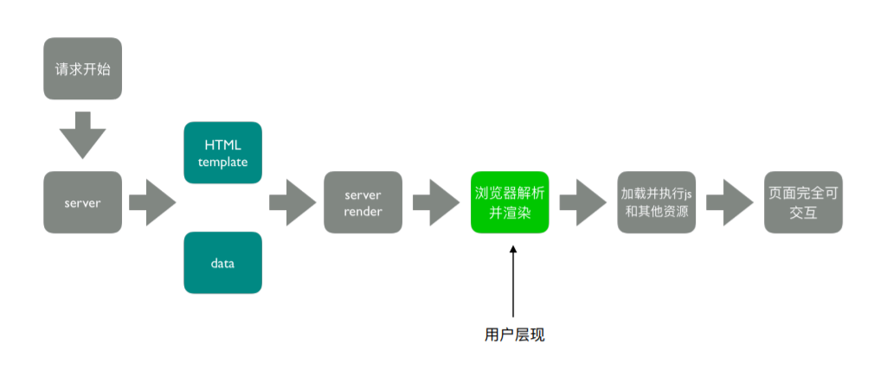
SSR的核心是减少请求
优势，减少白屏时间，对SEO友好

ps.
> 大厂是有一套比较完善的CI/CD工作流程，比如：Gitlab CI或者Jenkins CI等等。每次代码push都会经过CI阶段，会开一个Docker镜像跑任务。进行代码打包构建、单元测试和代码ESLint检查。

> 如果没问题，则会进行测试环境或者生产环境的代码部署，这个阶段会经历Code Review，打出版本包，包升级下发到指定机器。然后完成部署流程。

#### 代码实现
- 服务端
  - 使用react-dom/server的renderToString方法将react渲染成字符串
  - 服务端路由返回对应的模板
- 客户端
  - 打包出针对服务端的组件

webpack.ssr.config
```js
'use strict';

const glob = require('glob');
const path = require('path');
const webpack = require('webpack');
const MiniCssExtractPlugin = require('mini-css-extract-plugin');
const OptimizeCSSAssetsPlugin = require('optimize-css-assets-webpack-plugin');
const HtmlWebpackPlugin = require('html-webpack-plugin');
const CleanWebpackPlugin = require('clean-webpack-plugin');
const HtmlWebpackExternalsPlugin = require('html-webpack-externals-plugin');
const FriendlyErrorsWebpackPlugin = require('friendly-errors-webpack-plugin');

const setMPA = () => {
    const entry = {};
    const htmlWebpackPlugins = [];
    const entryFiles = glob.sync(path.join(__dirname, './src/*/index-server.js'));

    Object.keys(entryFiles)
        .map((index) => {
            const entryFile = entryFiles[index];
            // '/Users/cpselvis/my-project/src/index/index.js'

            const match = entryFile.match(/src\/(.*)\/index-server\.js/);
            const pageName = match && match[1];

            if (pageName) {
                entry[pageName] = entryFile;
                htmlWebpackPlugins.push(
                    new HtmlWebpackPlugin({
                        inlineSource: '.css$',
                        template: path.join(__dirname, `src/${pageName}/index.html`),
                        filename: `${pageName}.html`,
                        chunks: ['vendors', pageName],
                        inject: true,
                        minify: {
                            html5: true,
                            collapseWhitespace: true,
                            preserveLineBreaks: false,
                            minifyCSS: true,
                            minifyJS: true,
                            removeComments: false
                        }
                    })
                );
            }
        });

    return {
        entry,
        htmlWebpackPlugins
    }
}

const { entry, htmlWebpackPlugins } = setMPA();

module.exports = {
    entry: entry,
    output: {
        path: path.join(__dirname, 'dist'),
        filename: '[name]-server.js',
        libraryTarget: 'umd'
    },
    mode: 'none',
    module: {
        rules: [
            {
                test: /.js$/,
                use: [
                    'babel-loader',
                    // 'eslint-loader'
                ]
            },
            {
                test: /.css$/,
                use: [
                    MiniCssExtractPlugin.loader,
                    'css-loader'
                ]
            },
            {
                test: /.less$/,
                use: [
                    MiniCssExtractPlugin.loader,
                    'css-loader',
                    'less-loader',
                    {
                        loader: 'postcss-loader',
                        options: {
                            plugins: () => [
                                require('autoprefixer')({
                                    browsers: ['last 2 version', '>1%', 'ios 7']
                                })
                            ]
                        }
                    },
                    {
                        loader: 'px2rem-loader',
                        options: {
                            remUnit: 75,
                            remPrecision: 8
                        }
                    }
                ]
            },
            {
                test: /.(png|jpg|gif|jpeg)$/,
                use: [
                    {
                        loader: 'file-loader',
                        options: {
                            name: '[name]_[hash:8].[ext]'
                        }
                    }
                ]
            },
            {
                test: /.(woff|woff2|eot|ttf|otf)$/,
                use: [
                    {
                        loader: 'file-loader',
                        options: {
                            name: '[name]_[hash:8][ext]'
                        }
                    }
                ]
            }
        ]
    },
    plugins: [
        new MiniCssExtractPlugin({
            filename: '[name]_[contenthash:8].css'
        }),
        new OptimizeCSSAssetsPlugin({
            assetNameRegExp: /\.css$/g,
            cssProcessor: require('cssnano')
        }),
        new CleanWebpackPlugin(),
        // new HtmlWebpackExternalsPlugin({
        //     externals: [
        //       {
        //         module: 'react',
        //         entry: 'https://11.url.cn/now/lib/16.2.0/react.min.js',
        //         global: 'React',
        //       },
        //       {
        //         module: 'react-dom',
        //         entry: 'https://11.url.cn/now/lib/16.2.0/react-dom.min.js',
        //         global: 'ReactDOM',
        //       },
        //     ]
        // }),
        new FriendlyErrorsWebpackPlugin(),
        function() {
            this.hooks.done.tap('done', (stats) => {
                if (stats.compilation.errors && stats.compilation.errors.length && process.argv.indexOf('--watch') == -1)
                {
                    console.log('build error');
                    process.exit(1);
                }
            })
        }    
    ].concat(htmlWebpackPlugins),
    // optimization: {
    //     splitChunks: {
    //         minSize: 0,
    //         cacheGroups: {
    //             commons: {
    //                 name: 'commons',
    //                 chunks: 'all',
    //                 minChunks: 2
    //             }
    //         }
    //     }
    // }
    stats: 'errors-only'
};
```

server express服务器

实际就是把组件转化成字符串，插入模板，然后通过服务器返回
```js
if (typeof window === 'undefined') {
    global.window = {};
}

const fs = require('fs');
const path = require('path');
const express = require('express');
const {
    renderToString
} = require('react-dom/server');
const SSR = require('../dist/search-server');
const template = fs.readFileSync(path.join(__dirname, '../dist/search.html'), 'utf-8');
const data = require('./data.json');

const server = (port) => {
    const app = express();

    app.use(express.static('dist'));
    app.get('/search', (req, res) => {
        const html = renderMarkup(renderToString(SSR));
        res.status(200).send(html);
    });

    app.listen(port, () => {
        console.log('Server is running on port:' + port);
    });
};

server(process.env.PORT || 3000);

const renderMarkup = (str) => {
    const dataStr = JSON.stringify(data);
    // 用占位符解决css不显示问题
    return template.replace('<!--HTML_PLACEHOLDER-->', str) 
        .replace('<!--INITIAL_DATA_PLACEHOLDER-->', `<script>window.__initial_data=${dataStr}</script>`);
}

```

对应的组件的改造
```js
'use strict';

// import React from 'react';
// import largeNumber from 'large-number';
// import logo from './images/logo.png';
// import './search.less';
const React = require('react');
const largeNumber = require('large-number');
const logo = require('./images/logo.png');
const s = require('./search.less');

class Search extends React.Component {

    constructor() {
        super(...arguments);

        this.state = {
            Text: null
        };
    }

    loadComponent() {
        import('./text.js').then((Text) => {
            this.setState({
                Text: Text.default
            });
        });
    }

    render() {
        const { Text } = this.state;
        const addResult = largeNumber('999', '1');
        return <div className="search-text">
            {
                Text ? <Text /> : null
            }
            { addResult }
            搜索文字的内容
        </div>;
    }
}

module.exports = <Search />;
```

#### 存在差异
  - node没有浏览器全局变量
    - 组件适配： 将不兼容的组件按照打包环境进行适配
    - 请求适配： 将fetch或者ajax请求改成isomorphic-fetch 或者 axios
  - 样式问题
    - 服务端打包通过ignore-loader忽略掉css解析
    - 将style-loader替换成 isomorphic-style-loader


#### 解决样式不显示问题
使用打包出来的浏览器端html为模板<br>
设置占位符，动态插入组件

index.html
```html
<!DOCTYPE html>
<html lang="en">
<head>
    ${ require('raw-loader!./meta.html')}
    <title>Document</title>
    <script>${ require('raw-loader!babel-loader!../../node_modules/lib-flexible/flexible.js')}</script>
</head>
<body>
    <div id="root"><!--HTML_PLACEHOLDER--></div>
    <script type="text/javascript" src="https://11.url.cn/now/lib/16.2.0/react.min.js"></script>
    <script type="text/javascript" src="https://11.url.cn/now/lib/16.2.0/react-dom.min.js"></script>
    <!--INITIAL_DATA_PLACEHOLDER-->
</body>
</html>
```
### 优化构建命令行显示日志
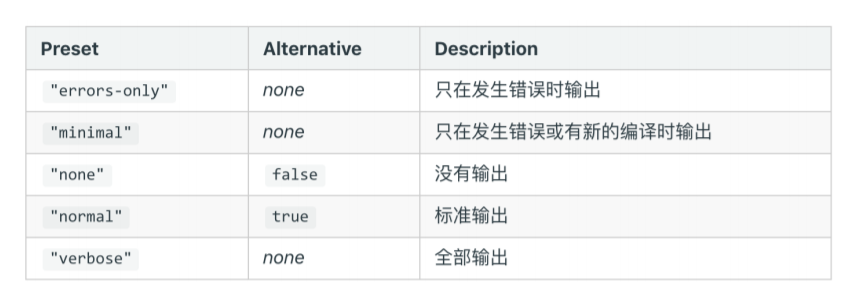

使用friendly-errors-webpack-plugin
```js
module.exports = {
  plugins: [
    new FriendlyErrorsWebpackPlugin()
  ],
  stats: 'error-only'
}
```
### 构建异常和中断处理
CI/CD的pipline后者发布系统需要知道构建是否成功<br>
每次构建完成后输入 echo $? 获取错误码 <br>
Node.js的process.exit规范
> 0 便是成功，回调函数中 err为null
> 非0表示失败， 回调中 err不为null err.code就是传给exit的数字
如何主动捕获并处理构建错误
> compiler对象在每次构建结束后会触发done这个hook, process.exit主动处理构建报错
```js
function() {
    this.hooks.done.tap('done', (stats) => { // this 是 compiler
        if (stats.compilation.errors && stats.compilation.errors.length && process.argv.indexOf('--watch') == -1)
        {
            console.log('build error');
            process.exit(1); // 可以上报错误等操作
        }
    })
}
```

## 编写可维护的webpack构建配置
### 构建配置包设计
1. 构建配置抽离成npm包的意义
- 通用型
  - 业务开发者无需关注构建配置
  - 统一团队构建脚本
- 可维护性
  - 构建配置合理的拆分
  - README，ChangeLog等
- 质量
  - 冒烟测试，单元测试， 测试覆盖率
  - 持续集成
2. 构建配置管理的可选方案
  - 通过多个配置文件管理不通环境的构建
  - 将构建配置设计成一个库 如 hjs-webpack Neutrino webpack-blocks
  - 抽成一个工具进行管理 如 create-react-app kyt nwb
  - 将所有配置放在一个文件， 通过 --env参数控制分支选择

  团队规模不大可以用 1.2 团队有实力可以考虑3
### 功能模块和目录结构
多配置文件方案
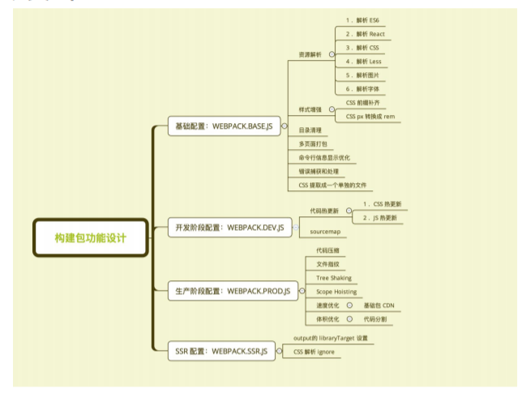

目录结构<br>
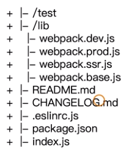
webpack.base.js
```js

const autoprefixer = require('autoprefixer');
const glob = require('glob');
const path = require('path');
const CleanWebpackPlugin = require('clean-webpack-plugin');
const FriendlyErrorsWebpackPlugin = require('friendly-errors-webpack-plugin');
const HtmlWebpackPlugin = require('html-webpack-plugin');
const MiniCssExtractPlugin = require('mini-css-extract-plugin');

const projectRoot = process.cwd();

const setMPA = () => {
  const entry = {};
  const htmlWebpackPlugins = [];
  const entryFiles = glob.sync(path.join(projectRoot, './src/*/index.js'));

  Object.keys(entryFiles)
    .map((index) => {
      const entryFile = entryFiles[index];
      // '/Users/cpselvis/my-project/src/index/index.js'

      const match = entryFile.match(/src\/(.*)\/index\.js/);
      const pageName = match && match[1];

      entry[pageName] = entryFile;
      return htmlWebpackPlugins.push(
        new HtmlWebpackPlugin({
          inlineSource: '.css$',
          template: path.join(projectRoot, `./src/${pageName}/index.html`),
          filename: `${pageName}.html`,
          chunks: ['vendors', pageName],
          inject: true,
          minify: {
            html5: true,
            collapseWhitespace: true,
            preserveLineBreaks: false,
            minifyCSS: true,
            minifyJS: true,
            removeComments: false,
          },
        })
      );
    });

  return {
    entry,
    htmlWebpackPlugins,
  };
};

const { entry, htmlWebpackPlugins } = setMPA();

module.exports = {
  entry: entry,
  output: {
    path: path.join(projectRoot, 'dist'),
    filename: '[name]_[chunkhash:8].js'
  },
  module: {
    rules: [
      {
        test: /.js$/,
        use: [
          {
            loader: 'babel-loader'
          }
        ],
      },
      {
        test: /.css$/,
        use: [
          MiniCssExtractPlugin.loader,
          'css-loader',
        ],
      },
      {
        test: /.less$/,
        use: [
          MiniCssExtractPlugin.loader,
          'css-loader',
          'less-loader',
          {
            loader: 'postcss-loader',
            options: {
              plugins: () => [
                autoprefixer({
                  browsers: ['last 2 version', '>1%', 'ios 7'],
                }),
              ],
            },
          },
          {
            loader: 'px2rem-loader',
            options: {
              remUnit: 75,
              remPrecision: 8,
            },
          },
        ],
      },
      {
        test: /.(png|jpg|gif|jpeg)$/,
        use: [
          {
            loader: 'file-loader',
            options: {
              name: '[name]_[hash:8].[ext]',
            },
          },
        ],
      },
      {
        test: /.(woff|woff2|eot|ttf|otf)$/,
        use: [
          {
            loader: 'file-loader',
            options: {
              name: '[name]_[hash:8][ext]',
            },
          },
        ],
      },
    ],
  },
  plugins: [
    new MiniCssExtractPlugin({
      filename: '[name]_[contenthash:8].css',
    }),
    new CleanWebpackPlugin(),
    new FriendlyErrorsWebpackPlugin(),
    function errorPlugin() {
      this.hooks.done.tap('done', (stats) => {
        if (stats.compilation.errors && stats.compilation.errors.length && process.argv.indexOf('--watch') === -1) {
          process.exit(1);
        }
      });
    },
  ].concat(htmlWebpackPlugins),
  stats: 'errors-only',
};
```
webpack.dev.js
```js
const merge = require('webpack-merge');
const webpack = require('webpack');
const baseConfig = require('./webpack.base');

const devConfig = {
  mode: 'production',
  plugins: [
    new webpack.HotModuleReplacementPlugin(),
  ],
  devServer: {
    contentBase: './dist',
    hot: true,
    stats: 'errors-only',
  },
  devtool: 'cheap-source-map',
};

module.exports = merge(baseConfig, devConfig);

```
webpack.prod.js
```js

const cssnano = require('cssnano');
const merge = require('webpack-merge');
const HtmlWebpackExternalsPlugin = require('html-webpack-externals-plugin');
const OptimizeCSSAssetsPlugin = require('optimize-css-assets-webpack-plugin');
const baseConfig = require('./webpack.base');

const prodConfig = {
  mode: 'production',
  plugins: [
    new OptimizeCSSAssetsPlugin({
      assetNameRegExp: /\.css$/g,
      cssProcessor: cssnano,
    }),
    new HtmlWebpackExternalsPlugin({
      externals: [
        {
          module: 'react',
          entry: 'https://11.url.cn/now/lib/16.2.0/react.min.js',
          global: 'React',
        },
        {
          module: 'react-dom',
          entry: 'https://11.url.cn/now/lib/16.2.0/react-dom.min.js',
          global: 'ReactDOM',
        },
      ],
    }),
  ],
  optimization: {
    splitChunks: {
      minSize: 0,
      cacheGroups: {
        commons: {
          name: 'commons',
          chunks: 'all',
          minChunks: 2,
        },
      },
    },
  },
};

module.exports = merge(baseConfig, prodConfig);

```
webpack.ssr.js
```js
const cssnano = require('cssnano');
const merge = require('webpack-merge');
const HtmlWebpackExternalsPlugin = require('html-webpack-externals-plugin');
const OptimizeCSSAssetsPlugin = require('optimize-css-assets-webpack-plugin');
const baseConfig = require('./webpack.base');

const prodConfig = {
  mode: 'production',
  module: {
    rules: [
      {
        test: /\.css$/,
        use: 'ignore-loader', // ignore css
      },
      {
        test: /\.less$/,
        use: 'ignore-loader',
      },
    ],
  },
  plugins: [
    new OptimizeCSSAssetsPlugin({
      assetNameRegExp: /\.css$/g,
      cssProcessor: cssnano,
    }),
    new HtmlWebpackExternalsPlugin({
      externals: [
        {
          module: 'react',
          entry: 'https://11.url.cn/now/lib/16.2.0/react.min.js',
          global: 'React',
        },
        {
          module: 'react-dom',
          entry: 'https://11.url.cn/now/lib/16.2.0/react-dom.min.js',
          global: 'ReactDOM',
        },
      ],
    }),
  ],
  optimization: {
    splitChunks: {
      minSize: 0,
      cacheGroups: {
        commons: {
          name: 'commons',
          chunks: 'all',
          minChunks: 2,
        },
      },
    },
  },
};

module.exports = merge(baseConfig, prodConfig);
```
### ESLint规范脚本
.eslintrc.js
```js
module.exports = {
    "parser": "babel-eslint",
    "extends": "airbnb-base",
    "env": {
        "browser": true,
        "node": true
    }
};
```
### 冒烟测试
提交测试的软件在进行详细深入的测试之前进行的预测试，这种测试的主要目的是暴露导致软件需重新发布的基本功能失效等严重问题

#### 构建是否成功
指标：
1. 是否有js css 等静态文件
2. 是否有html文件

方法：
1. 看构建是否报错
2. 编写单元测试用例, 看是否有css,js, 是否有html

#### 测试文件编写
新建 test/smoke 目录<br>
index.js
```js
const path = require('path');
const webpack = require('webpack');
const rimraf = require('rimraf');
const Mocha = require('mocha');

const mocha = new Mocha({
    timeout: '10000ms'
});

process.chdir(path.join(__dirname, 'template'));

rimraf('./dist', () => {
    const prodConfig = require('../../lib/webpack.prod.js');

    webpack(prodConfig, (err, stats) => {
        if (err) {
            console.error(err);
            process.exit(2);
        }
        console.log(stats.toString({
            colors: true,
            modules: false,
            children: false
        }));

        console.log('Webpack build success, begin run test.');

        mocha.addFile(path.join(__dirname, 'html-test.js'));
        mocha.addFile(path.join(__dirname, 'css-js-test.js'));
        mocha.run();
    });
});
```
css js 单测文件 css-js-test.js
```js
const glob = require('glob-all');

describe('Checking generated css js files', () => {
    it('should generate css js files', (done) => {
        const files = glob.sync([
            './dist/index_*.js',
            './dist/index_*.css',
            './dist/search_*.js',
            './dist/search_*.css',
        ]);

        if (files.length > 0) {
            done();
        } else {
            throw new Error('no css js files generated');
        }
    });
});
```
html 单测文件 html-test.js
```js
const glob = require('glob-all');

describe('Checking generated html files', () => {
    it('should generate html files', (done) => {
        const files = glob.sync([
            './dist/index.html',
            './dist/search.html'
        ]);

        if (files.length > 0) {
            done();
        } else {
            throw new Error('no html files generated');
        }
    });
});
```
同时测试目录外的webpack.base.js需要把改变路径写法
```js
const projectRoot = process.cwd();
const entryFiles = glob.sync(path.join(projectRoot, './src/*/index.js'));
// new HtmlWebpackPlugin
template: path.join(projectRoot, `./src/${pageName}/index.html`),
// module.exports
output: {
    path: path.join(projectRoot, 'dist'),
    filename: '[name]_[chunkhash:8].js'
  },

```
### 单元测试与测试覆盖率
test 目录下 新建 unit
test/index.js
```js
const path = require('path');

// 进入smoke/template
process.chdir(path.join(__dirname, 'smoke/template'));

describe('builder-webpack test case', () => {
    require('./unit/webpack-base-test');
});
```
unit/webpack-base-test
```js
const assert = require('assert');

describe('webpack.base.js test case', () => {
    const baseConfig = require('../../lib/webpack.base.js')

    it('entry', () => {
        assert.equal(baseConfig.entry.index, '/Users/cpselvis/my-project/builder-webpack/test/smoke/template/src/index/index.js');
        assert.equal(baseConfig.entry.search.indexOf('builder-webpack/test/smoke/template/src/search/index.js') > -1, true);// 为了持续集成配合线上路径
    });
});
```
测试覆盖率 istanbul<br>
package.json
```js
 "test": "istanbul cover ./node_modules/.bin/_mocha",
```
### 持续集成
#### 持续集成优点
- 快速发现错误
- 防止分支大幅偏离主干
核心措施是，代码集成到主干前，必须通过自动化测试，只要有一个测试用例失败，就不能集成。
#### 接入 Travis CI
1. https://travis-ci.org/ 使用 GitHub 账号登录
2. 在 https://travis-ci.org/account/repositories 为项目开启
3. 项目根目录下新增 .travis.yml
#### .travis.yml文件内容
```yml
language: node_js
sudo: false
cache:
  apt: true
  directories:
    - node_modules
node_js: stable
install:
  - npm install -D
  - cd ./test/smoke/template
  - npm install -D
  - cd ../../../
scripts:
  -npm test
```
升级补丁版本号：npm version patch<br>
升级小版本号：npm version minor<br>
升级大版本号：npm version major<br>
将自动更改版本号，并提交git
### git规范和changeLog生成
良好的 Git commit 规范优势：<br>
- 加快 Code Review 的流程
- 根据 Git Commit 的元数据生成 Changelog
- 后续维护者可以知道 Feature 被修改的原因
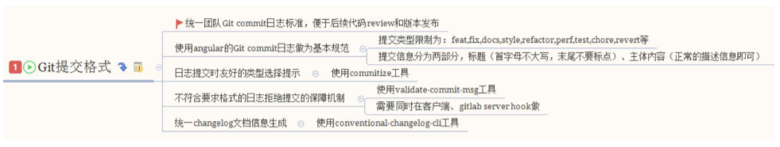
angular规范
```xml
<type>(<scope>): <subject>
<BLANK LINE>
<body>
<BLANK LINE>
<footer>
```
- 标题行: 必填, 描述主要修改类型和内容
- 主题内容: 描述为什么修改, 做了什么样的修改, 以及开发的思路等等
- 页脚注释: 放 Breaking Changes 或 Closed Issues

本地开发阶段增加precommit钩子
```bash
npm install husky -D
```
package.json
```json
"script": {
  "commitmsg": "validate-commit-msg",
  "changelog": "conventional-changelog -p
angular -i CHANGELOG.md -s -r 0"
}
```
validate-commit-msg 好像废弃了，推荐使用commitlint <br>
husky 0.12版本后，配置已改为：<br>
commit-msg<br>
pre-commit<br>
要加（-）横杠了

## 优化
## 源码
## 编写loader和plugin
## 实战 React